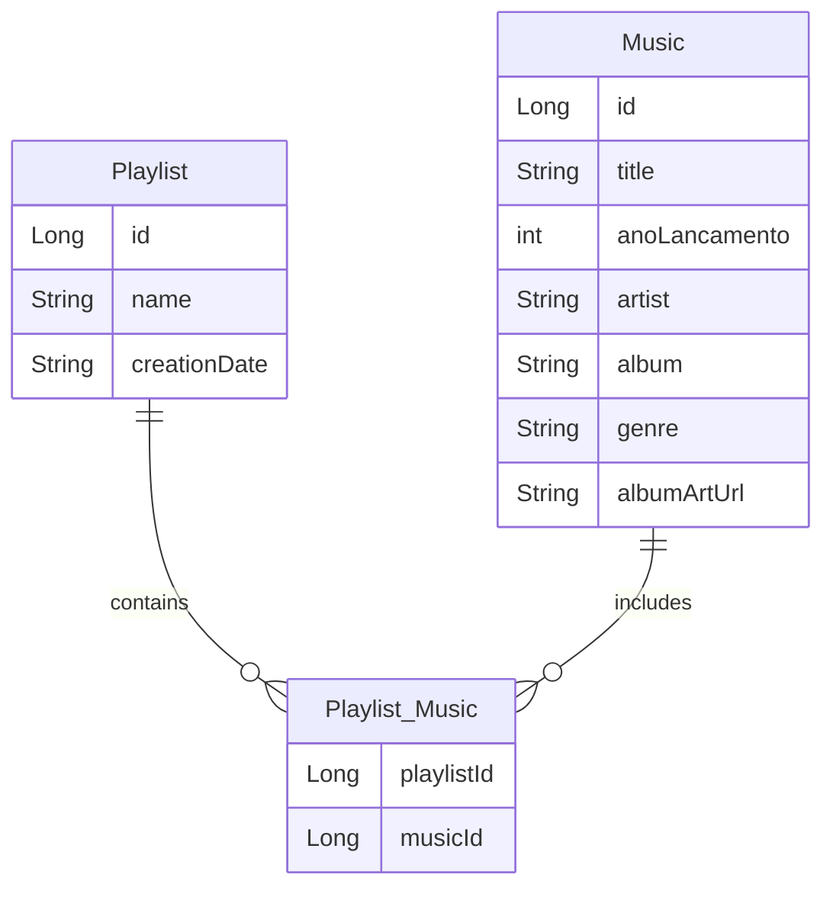

# 🎶 Playmix 

**Playmix** é uma aplicação de streaming de música que permite aos usuários criar e gerenciar suas próprias playlists. Com uma interface intuitiva, você pode descobrir novas músicas e personalizar suas coleções musicais de acordo com suas preferências. 

---

## 🚀 Funcionalidades

- **Criação de Playlists**: Crie playlists personalizadas com suas músicas favoritas. 🎧
- **Adição de Músicas**: Adicione músicas às suas playlists existentes de maneira fácil. 🎼
- **Navegação e Busca**: Encontre novas músicas e playlists rapidamente. 🔍
- **Organização**: Organize suas playlists por data de criação ou nome. 📅
- **Compartilhamento**: Compartilhe suas playlists com amigos e descubra o que eles estão ouvindo! 🔗

---

## 📚 Estrutura do Banco de Dados

A aplicação utiliza um modelo de banco de dados relacional com as seguintes tabelas:

### Diagrama de Relacionamento (Mermaid)

## 🛠 Tecnologias Utilizadas

- **Spring Boot**: Framework para desenvolvimento de aplicações Java.
- **Thymeleaf**: Motor de template para gerar páginas HTML dinâmicas.
- **Mermaid**: Para diagramação e visualização de relacionamentos de banco de dados.

