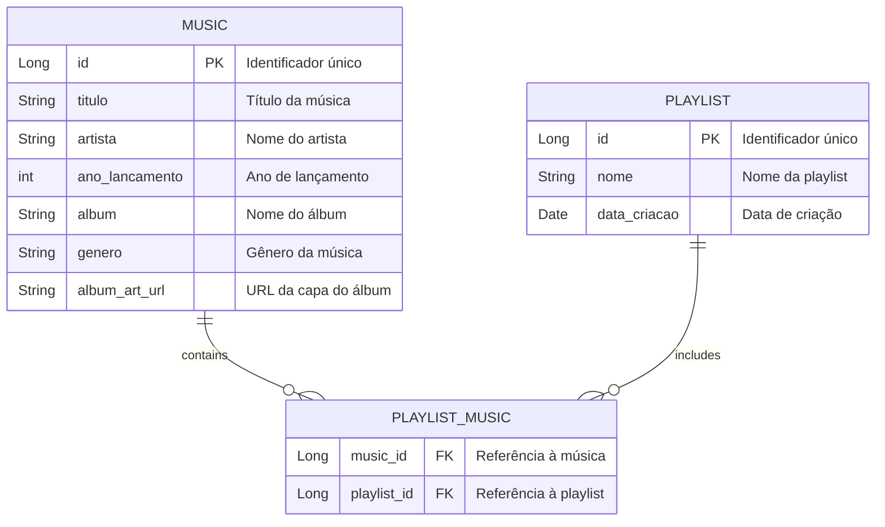

# 🎶 Playmix 

**Playmix** é uma aplicação de streaming de música que permite aos usuários criar e gerenciar suas próprias playlists de maneira simples e intuitiva. Com uma interface amigável, você pode descobrir novas músicas, explorar diferentes gêneros e personalizar suas coleções musicais de acordo com suas preferências.

---

## 🚀 Funcionalidades

- **Criação de Playlists**: Crie playlists personalizadas com suas músicas favoritas. 🎧
- **Adição de Músicas**: Adicione músicas às suas playlists existentes com facilidade. 🎼
- **Navegação e Busca**: Descubra novas músicas e playlists rapidamente através de uma busca eficiente. 🔍
- **Organização**: Organize suas playlists por data de criação, nome ou gênero musical. 📅
- **Compartilhamento**: Compartilhe suas playlists com amigos e descubra o que eles estão ouvindo! 🔗
- **Integração de Gêneros**: Explore uma variedade de gêneros musicais para encontrar novas faixas. 🎶
- **Experiência Personalizada**: Receba recomendações de músicas baseadas nas suas preferências e no seu histórico de reprodução. 🌟

---

## 📚 Estrutura do Banco de Dados

A aplicação utiliza um modelo de banco de dados relacional para gerenciar as informações das músicas, playlists e suas interações. Abaixo está o diagrama de Entidade e Relacionamento com as tabelas principais da estrutura do banco de dados:



---

## CRUD - Exemplos 📋

### 1. Criar 🎤

#### *Música*

Para criar uma nova música, você deve enviar um formulário com as seguintes informações:

```plaintext
Título: Hear Me Now
Artista: Alok
Ano de Lançamento: 2017
Álbum: Hear Me Now
Gênero: Electronic
URL da Capa do Álbum: https://abrir.link/ZjOqm
```

#### *Playlist*

Para criar uma nova playlist, você pode usar o seguinte formulário:

```plaintext
Nome: Minhas Favoritas
(Selecione as músicas )
```


### 2. Ler 📖

#### *Música*

Para ler os detalhes de uma música específica, apertando em 'Detalhes'.


#### *Playlist*

Para ler os detalhes de uma playlist específica, apertando em 'Detalhes'.


### 3. Atualizar ✏️

#### *Música*

Para atualizar as informações de uma música existente, você pode enviar o seguinte formulário:

```plaintext
Título: Hear Me Now (Atualizado)
Artista: Alok 
Ano de Lançamento: 2018
Álbum: Hear Me Now
Gênero: Electronic
URL da Capa do Álbum: https://abrir.link/ZjOqm
```

#### *Playlist*

Para atualizar uma playlist existente, você pode usar o seguinte formulário:

```plaintext
Nome: Minhas Favoritas Especiais
```

### 4. Excluir 🗑️

#### *Música*

Para excluir uma música, aperte em 'Excluir'.

#### *Playlist*

Para excluir uma playlist,  aperte em 'Excluir'.


---

## 🐳 Dockerfile e Rodando Localmente

Para rodar a aplicação localmente usando Docker, você pode usar o seguinte `Dockerfile`:

```Dockerfile
# Escolhendo a imagem base

# Configurando o diretório de trabalho
WORKDIR /app

# Copiando o arquivo JAR para o contêiner

# Expondo a porta da aplicação
EXPOSE 8080

# Comando para iniciar a aplicação

```

### Rodando a Aplicação

Para construir e rodar a imagem, utilize os seguintes comandos:

```bash
docker build -t playmix .
docker run -p 8080:8080 playmix
```

---

## 🚀 Deploy - ACI e ACR Azure

Para realizar o deploy da aplicação no Azure, você pode utilizar o Azure Container Instances (ACI) e o Azure Container Registry (ACR). Siga os passos abaixo:

1. **Crie um registro de contêiner no Azure**.
2. **Faça login no seu registro de contêiner**:

   ```bash
   az acr login --name <SeuRegistroACR>
   ```

3. **Envie sua imagem para o ACR**:

   ```bash
   docker tag playmix <SeuRegistroACR>.azurecr.io/playmix
   docker push <SeuRegistroACR>.azurecr.io/playmix
   ```

4. **Implante a imagem usando o ACI**:

   ```bash
   az container create --resource-group <SeuGrupoDeRecursos> --name playmix-container --image <SeuRegistroACR>.azurecr.io/playmix --ports 8080
   ```

