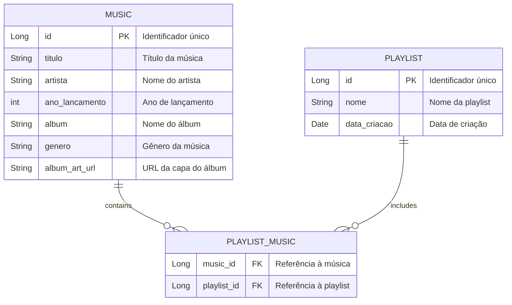

# 🎧 Playmix 

**Playmix** é uma aplicação de streaming de música que permite aos usuários criar e gerenciar suas próprias playlists de maneira simples e intuitiva. Com uma interface amigável, você pode descobrir novas músicas, explorar diferentes gêneros e personalizar suas coleções musicais de acordo com suas preferências.

---
## 🛤️ Rotas da Aplicação

### 🏠 Home (`index.html`)

- **Página Inicial**: `GET /`  
  A página inicial do Playmix, com opções para gerenciar músicas e playlists.   

> [!NOTE]
> **🔗 Acesse a página inicial através da URL:**
> ```plaintext
> http://playmixRM552258.azurecontainer.io/
> ```

### 🎵 Músicas (`MusicController`)
- **Listar**: `GET /musics`  - Exibe todas as músicas.  
- **Detalhes**: `GET /musics/{id}`  - Detalhes de uma música.  
- **Adicionar**: `GET /musics/new`  - Formulário para nova música.  
- **Salvar**: `POST /musics`  - Cria uma nova música. 🎤  
- **Editar**: `GET /musics/edit/{id}`  - Formulário para editar música. ✏️  
- **Atualizar**: `POST /musics/{id}`  - Atualiza uma música existente. 🔄  
- **Excluir**: `GET /musics/delete/{id}`  - Remove uma música. ❌  

### 🎶 Gerenciamento de Playlists (`PlaylistController`) 
- **Listar**: `GET /playlists`  - Exibe todas as playlists.  
- **Detalhes**: `GET /playlists/{id}`  - Detalhes de uma playlist. 📜  
- **Adicionar**: `GET /playlists/new`  - Formulário para nova playlist. ➕  
- **Salvar**: `POST /playlists`  - Cria uma nova playlist. 🎼  
- **Editar**: `GET /playlists/edit/{id}`  - Formulário para editar playlist. ✏️  
- **Atualizar**: `POST /playlists/{id}`  - Atualiza uma playlist existente. 🔄  
- **Excluir**: `GET /playlists/delete/{id}`  - Remove uma playlist. ❌  
---

## 📚 Estrutura do Banco de Dados

A aplicação utiliza um modelo de banco de dados relacional para gerenciar as informações das músicas, playlists e suas interações. Abaixo está o diagrama de Entidade e Relacionamento com as tabelas principais da estrutura do banco de dados:



---

## CRUD - Exemplos 📋

### 1. Criar 🎤

#### *Música*

Para criar uma nova música, você deve enviar um formulário com as seguintes informações:

```plaintext
Título: Baby
Artista: Justin Bieber
Ano de Lançamento: 2010
Álbum: My World 2.0
Gênero: POP
URL da Capa do Álbum: https://abrir.link/jtJPk
```

#### *Playlist*

Para criar uma nova playlist, você pode usar o seguinte formulário:

```plaintext
Nome: Nostalgia Playlist
(Selecione as músicas )
```


### 2. Ler 📖

#### *Música*

Para ler os detalhes de uma música específica, aperte em 'Detalhes'.


#### *Playlist*

Para ler os detalhes de uma playlist específica, aperte em 'Detalhes'.


### 3. Atualizar ✏️

#### *Música*

Para atualizar as informações de uma música existente, você pode enviar o seguinte formulário:

```plaintext
Título: Baby Music
Artista: Justin
Ano de Lançamento: 2011
Álbum: My World 2.0.0
Gênero: SOUL
URL da Capa do Álbum: https://abrir.link/jtJPk
```

#### *Playlist*

Para atualizar uma playlist existente, você pode usar o seguinte formulário:

```plaintext
Nome: Pop Nostalgia Favoritas
```

### 4. Excluir 🗑️

#### *Música*

Para excluir uma música, aperte em 'Excluir'.

#### *Playlist*

Para excluir uma playlist, aperte em 'Excluir'.


---

## 🐳 Dockerfile e Rodando Localmente

Para rodar a aplicação localmente usando Docker, você pode usar o seguinte `Dockerfile`:

```Dockerfile
# Use a imagem base do OpenJDK 17
FROM eclipse-temurin:17-jre-alpine

# Defina o diretório de trabalho
WORKDIR /app

# Adicione um usuário não privilegiado
RUN adduser -D appuser

# Copie o arquivo JAR para o contêiner
COPY target/*.jar app.jar

# Altere a propriedade do arquivo JAR para o usuário não privilegiado
RUN chown appuser:appuser app.jar

# Mude para o usuário não privilegiado
USER appuser

# Exponha a porta da aplicação
EXPOSE 8080

# Comando para iniciar a aplicação
CMD ["java", "-jar", "app.jar"]
```

### Rodando a Aplicação

Para construir e rodar a imagem Docker, utilize os seguintes comandos:

```bash
# Construir a imagem Docker
docker build -t playmix-app .

# Rodar a imagem localmente
docker run --name playmix-app-container -d -p 8080:8080 playmix-app
```

- **Acessando a aplicação**: Abra `http://localhost:8080` em seu navegador.
  
- Para parar e remover o contêiner quando não for mais necessário:

```bash
docker rm playmix-app-container -f
```

- Para remover a imagem Docker após o uso:

```bash
docker rmi playmix-app
```

---

## 🚀 Deploy - ACI e ACR Azure

Para realizar o deploy da aplicação no Azure, você pode utilizar o **Azure Container Registry (ACR)** e o **Azure Container Instances (ACI)**. Siga os passos abaixo para completar o processo:

### 🛠️ Pré-requisitos

1. **Conta Azure**: Certifique-se de ter uma conta no [Azure](https://azure.microsoft.com/). 🌐
2. **Azure CLI**: Instale a [Azure CLI](https://docs.microsoft.com/pt-br/cli/azure/install-azure-cli) na sua máquina. 💻
3. **Docker**: Tenha o Docker instalado e em execução na sua máquina. 🐳

### 📋 Passo a Passo

#### 1. Criar Grupo de Recursos 🌳

```bash
az group create --name rg-playmix --location eastus
```
- **Análise**: Este comando cria um grupo de recursos chamado `rg-playmix` na região `eastus`.

#### 2. Criar Azure Container Registry (ACR) 🗄️

```bash
az acr create --resource-group rg-playmix --name playmixappRM552258 --sku Basic
```
- **Análise**: Cria um registro de contêiner no Azure. Verifique se o nome é único.

#### 3. Login no ACR 🔑

```bash
az acr login --name playmixappRM552258
```
- **Análise**: Realiza o login no ACR.

#### 4. Tag e Push da Imagem Docker 📦

```bash
# Tag da imagem
docker tag playmix-app playmixappRM552258.azurecr.io/playmixappRM552258:v1

# Push da imagem para o ACR
docker push playmixappRM552258.azurecr.io/playmixappRM552258:v1
```
- **Análise**: Tagueia a imagem local com o repositório ACR e realiza o push.

#### 5. Habilitar Credenciais Administrativas 🔑

```bash
az acr update -n playmixappRM552258 --admin-enabled true
```
- **Análise**: Habilita o acesso administrativo.

```bash
az acr credential show -n playmixappRM552258
```
- **Análise**: Mostra as credenciais para acessar o ACR.

#### 6. Criar Azure Container Instance (ACI) 🏗️

```bash
az container create --resource-group rg-playmix --name playmixRM552258 --image playmixappRM552258.azurecr.io/playmixappRM552258:v1 --cpu 1 --memory 1 --registry-login-server playmixappRM552258.azurecr.io --registry-username playmixappRM552258 --registry-password Sg7PjWqrbKHUJGf+7dEZU6sC5nPOyLJzWSQthg5f69+ACRAU01uS --ip-address Public --dns-name-label playmixRM552258 --ports 8080
```
- **Análise**: Cria uma instância de contêiner no Azure com as especificações fornecidas. **Segurança**: Não exponha suas senhas em scripts. Verifique a unicidade do `dns-name-label`.

---

## 📂 Recursos Adicionais

- **Docker Documentation**: [https://docs.docker.com/](https://docs.docker.com/) 📖
- **Azure Container Registry**: [https://docs.microsoft.com/pt-br/azure/container-registry/](https://docs.microsoft.com/pt-br/azure/container-registry/) ☁️
- **Azure Container Instances**: [https://docs.microsoft.com/pt-br/azure/container-instances/](https://docs.microsoft.com/pt-br/azure/container-instances/) 🌍
- **Spring Boot Docker Documentation**: [https://spring.io/guides/gs/spring-boot-docker/](https://spring.io/guides/gs/spring-boot-docker/)

