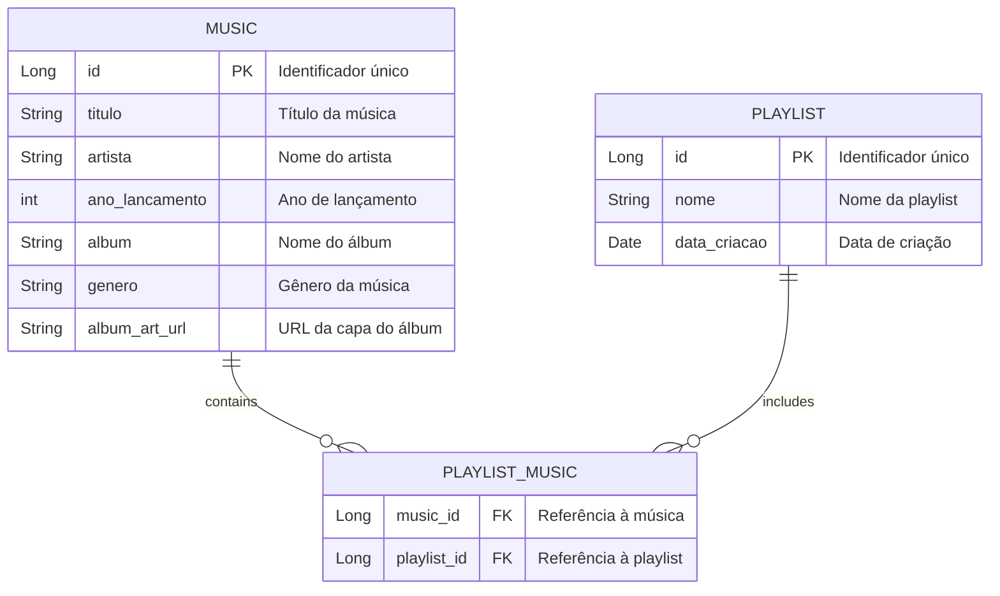

# 🎶 Playmix 

**Playmix** é uma aplicação de streaming de música que permite aos usuários criar e gerenciar suas próprias playlists de maneira simples e intuitiva. Com uma interface amigável, você pode descobrir novas músicas, explorar diferentes gêneros e personalizar suas coleções musicais de acordo com suas preferências.

---

## 🚀 Funcionalidades

- **Criação de Playlists**: Crie playlists personalizadas com suas músicas favoritas. 🎧
- **Adição de Músicas**: Adicione músicas às suas playlists existentes com facilidade. 🎼
- **Navegação e Busca**: Descubra novas músicas e playlists rapidamente através de uma busca eficiente. 🔍
- **Organização**: Organize suas playlists por data de criação, nome ou gênero musical. 📅
- **Compartilhamento**: Compartilhe suas playlists com amigos e descubra o que eles estão ouvindo! 🔗
- **Integração de Gêneros**: Explore uma variedade de gêneros musicais para encontrar novas faixas. 🎶
- **Experiência Personalizada**: Receba recomendações de músicas baseadas nas suas preferências e no seu histórico de reprodução. 🌟

---

## 📚 Estrutura do Banco de Dados

A aplicação utiliza um modelo de banco de dados relacional para gerenciar as informações das músicas, playlists e suas interações. Abaixo está o diagrama de Entidade e Relacionamento com as tabelas principais da estrutura do banco de dados:



---

## CRUD - Exemplos 📋

### 1. Criar 🎤

#### *Música*

Para criar uma nova música, você deve enviar um formulário com as seguintes informações:

```plaintext
Título: Hear Me Now
Artista: Alok
Ano de Lançamento: 2017
Álbum: Hear Me Now
Gênero: Electronic
URL da Capa do Álbum: https://abrir.link/ZjOqm
```

#### *Playlist*

Para criar uma nova playlist, você pode usar o seguinte formulário:

```plaintext
Nome: Minhas Favoritas
(Selecione as músicas )
```


### 2. Ler 📖

#### *Música*

Para ler os detalhes de uma música específica, apertando em 'Detalhes'.


#### *Playlist*

Para ler os detalhes de uma playlist específica, apertando em 'Detalhes'.


### 3. Atualizar ✏️

#### *Música*

Para atualizar as informações de uma música existente, você pode enviar o seguinte formulário:

```plaintext
Título: Hear Me Now (Atualizado)
Artista: Alok 
Ano de Lançamento: 2018
Álbum: Hear Me Now
Gênero: Electronic
URL da Capa do Álbum: https://abrir.link/ZjOqm
```

#### *Playlist*

Para atualizar uma playlist existente, você pode usar o seguinte formulário:

```plaintext
Nome: Minhas Favoritas Especiais
```

### 4. Excluir 🗑️

#### *Música*

Para excluir uma música, aperte em 'Excluir'.

#### *Playlist*

Para excluir uma playlist,  aperte em 'Excluir'.


---

## 🐳 Dockerfile e Rodando Localmente

Para rodar a aplicação localmente usando Docker, você pode usar o seguinte `Dockerfile`:

```Dockerfile
# Escolhendo a imagem base

# Configurando o diretório de trabalho
WORKDIR /app

# Copiando o arquivo JAR para o contêiner

# Expondo a porta da aplicação
EXPOSE 8080

# Comando para iniciar a aplicação

```

### Rodando a Aplicação

Para construir e rodar a imagem, utilize os seguintes comandos:

```bash
docker build -t playmix-app .
docker run -p 8080:8080 playmix-app
```

---

## 🚀 Deploy - ACI e ACR Azure

Para realizar o deploy da aplicação no Azure, você pode utilizar o **Azure Container Registry (ACR)** e o **Azure Container Instances (ACI)**. Siga os passos abaixo para completar o processo:

### 🛠️ Pré-requisitos

1. **Conta Azure**: Certifique-se de ter uma conta no [Azure](https://azure.microsoft.com/).
2. **Azure CLI**: Instale a [Azure CLI](https://docs.microsoft.com/pt-br/cli/azure/install-azure-cli) na sua máquina.
3. **Docker**: Tenha o Docker instalado e em execução na sua máquina.

### Passo a Passo

#### 1. **Login no Azure**

Abra o terminal e faça login na sua conta Azure:

```bash
az login
```

Siga as instruções no navegador para autenticação.

#### 2. **Criar um Grupo de Recursos**

Crie um grupo de recursos para organizar os serviços:

```bash
az group create --name PlaymixResourceGroup --location eastus
```

- **Parâmetros**:
    - `--name`: Nome do grupo de recursos.
    - `--location`: Região do Azure onde os recursos serão criados.

#### 3. **Criar um Azure Container Registry (ACR)**

Crie um registro de contêiner para armazenar sua imagem Docker:

```bash
az acr create --resource-group PlaymixResourceGroup --name RM552258PlaymixACR --sku Basic
```

- **Parâmetros**:
    - `--resource-group`: Nome do grupo de recursos.
    - `--name`: Nome único para o ACR (deve ser globalmente único).
    - `--sku`: Nível de serviço (`Basic`, `Standard`, `Premium`).

#### 4. **Fazer Login no ACR**

Realize o login no ACR para permitir o push da imagem:

```bash
az acr login --name RM552258PlaymixACR
```

#### 5. **Taguear a Imagem Docker para o ACR**

Tagueie sua imagem local para apontar para o ACR:

```bash
docker tag playmix-app RM552258PlaymixACR.azurecr.io/playmix-app:v1
```

- **Formato do Tag**:
    ```
    <ACR_Login_Server>/<nome_da_imagem>:<tag>
    ```
    Exemplo: `RM552258PlaymixACR.azurecr.io/playmix-app:v1`

#### 6. **Enviar a Imagem para o ACR**

Envie a imagem Docker para o ACR:

```bash
docker push RM552258PlaymixACR.azurecr.io/playmix-app:v1
```

#### 7. **Criar um Azure Container Instance (ACI)**

Crie um contêiner no Azure usando a imagem armazenada no ACR:

```bash
az container create \
    --resource-group PlaymixResourceGroup \
    --name RM552258PlaymixACI \
    --image RM552258PlaymixACR.azurecr.io/playmix-app:v1 \
    --cpu 1 \
    --memory 1 \
    --registry-login-server RM552258PlaymixACR.azurecr.io \
    --registry-username $(az acr credential show --name RM552258PlaymixACR --query "username" --output tsv) \
    --registry-password $(az acr credential show --name RM552258PlaymixACR --query "passwords[0].value" --output tsv) \
    --ports 8080
```

- **Parâmetros**:
    - `--resource-group`: Nome do grupo de recursos.
    - `--name`: Nome do ACI (utilize seu RM como prefixo).
    - `--image`: Caminho completo para a imagem no ACR.
    - `--cpu`: Número de CPUs alocadas.
    - `--memory`: Quantidade de memória alocada (em GB).
    - `--registry-login-server`: Endereço do ACR.
    - `--registry-username` e `--registry-password`: Credenciais do ACR.
    - `--ports`: Portas expostas pelo contêiner.

#### 8. **Obter o Endereço IP Público do ACI**

Após a criação do ACI, obtenha o endereço IP para acessar a aplicação:

```bash
az container show --resource-group PlaymixResourceGroup --name RM552258PlaymixACI --query ipAddress.ip --output tsv
```

Abra o navegador e acesse `http://<IP>:8080` para visualizar a aplicação em execução na nuvem.

#### 9. **Testar a Aplicação na Nuvem**

- **Operações CRUD**: Realize operações de **Create**, **Read**, **Update** e **Delete** para verificar a funcionalidade da aplicação.
- **Persistência de Dados**: Certifique-se de que as operações estão refletindo no banco de dados em nuvem.

#### 10. **Gerar Evidências**

- **Evidências Visuais**: Capture screenshots ou grave um vídeo demonstrando as operações CRUD e a interação com o banco de dados.
- **Scripts e Arquivos**: 
    - **Script DDL**: Armazene o script SQL no GitHub.
    - **Código Fonte**: Certifique-se de que todo o código, incluindo o `Dockerfile`, esteja versionado no GitHub.
    - **Arquivos JSON**: Inclua os arquivos utilizados para testes de API (`GET`, `POST`, `PUT`, `DELETE`) no repositório.

#### 11. **Documentação Final**

- **Folha de Rosto**: Inclua informações como:
    - Nome do Grupo
    - RM552258
    - Nome dos integrantes
    - Link do GitHub
    - Link do Vídeo criado

---

## 📂 Recursos Adicionais

- **Docker Documentation**: [https://docs.docker.com/](https://docs.docker.com/)
- **Azure Container Registry**: [https://docs.microsoft.com/pt-br/azure/container-registry/](https://docs.microsoft.com/pt-br/azure/container-registry/)
- **Azure Container Instances**: [https://docs.microsoft.com/pt-br/azure/container-instances/](https://docs.microsoft.com/pt-br/azure/container-instances/)
- **Spring Boot Docker Documentation**: [https://spring.io/guides/gs/spring-boot-docker/](https://spring.io/guides/gs/spring-boot-docker/)
